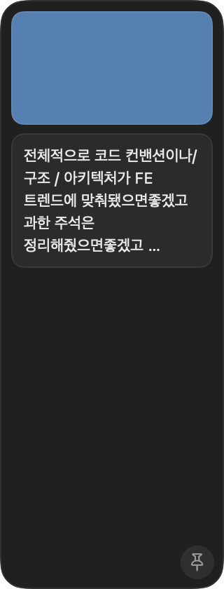

<p align="center">
  
</p>

<h1 align="center">Shelf · 선반</h1>

<p align="center">
  맥 화면 가장자리에 붙어 있는 작은 임시 보관함.<br>
  끌어다 놓고, 필요할 때 다시 꺼낸다. 무료, 오픈소스, 로그인 없음.
</p>

<p align="center">
  <a href="README.md">English</a> ·
  <a href="https://github.com/E-JIWON/shelf/releases/latest">다운로드</a>
</p>

---

캡처를 떴는데 세 군데에 넣어야 한다. 뭔가 복사했는데 다른 걸 복사하다 날린다. 선반은 그 "사이"에 두는 자리다. 화면 가장자리에 들어가 있는 작은 유리판에 던져두면, 끝날 때까지 거기 있다.

## 뭘 하나

- **아무거나 던지기** — 캡처 썸네일, 이미지, 드래그한 텍스트, 파일. 패널 클릭 후 ⌘V도 됨.
- **다시 꺼내기** — Finder, 슬랙, 노션, 피그마 어디든 끌어다 놓기. 이미지는 진짜 파일로, 텍스트는 텍스트로.
- **그 자리에서 보기** — 카드 클릭하면 Quick Look. 텍스트 카드는 바로 편집창이 되고 타이핑하는 대로 저장.
- **거슬리지 않기** — 평소엔 10px 탭만 남기고 숨어 있다가, 탭에 마우스를 대거나 어디서든 드래그를 시작하면 스르륵 나온다.
- **놓은 자리에 있기** — 패널을 좌/우 아무 쪽으로 끌어다 놓으면 가장자리에 붙고 기억한다. 핀을 켜면 계속 열려 있음.
- **설정할 게 없음** — 계정, 동기화, 설정창 없음. 아이템은 `~/Library/Caches/Shelf` 폴더의 그냥 파일.

## 설치

**다운로드** (macOS 14 Sonoma 이상, Apple Silicon·Intel)

1. [최신 릴리즈](https://github.com/E-JIWON/shelf/releases/latest)에서 `Shelf.zip` 받아서 압축 해제.
2. `Shelf.app`을 `/Applications`로 옮기고 실행.
3. "확인되지 않은 개발자" 경고가 뜬다(공증을 안 받았음). **시스템 설정 → 개인정보 보호 및 보안**에서 **그래도 열기**를 누르거나, 터미널에서 한 번:
   ```bash
   xattr -cr /Applications/Shelf.app
   ```
4. 메뉴바에 트레이 아이콘이 생긴다. 재시작 후에도 쓰려면 거기서 **로그인 시 실행**을 켠다.

**소스에서 빌드**

```bash
git clone https://github.com/E-JIWON/shelf.git
cd shelf
./install.sh      # 릴리즈 빌드 → Shelf.app → /Applications
```

Xcode 15 이상(또는 Swift 5.9 커맨드라인 툴) 필요.

## 어떻게 돼 있나

| 파일 | 역할 |
|---|---|
| `ShelfApp.swift` | SwiftUI `App` 진입점 + `MenuBarExtra`. Dock 아이콘 없음. |
| `ShelfPanel.swift` | 앱을 활성화하지 않는 `NSPanel`. 가장자리 스냅, 숨김/펼침, 외부 드래그 감지, Quick Look 팝오버. |
| `Store.swift` | 데이터 레이어 = 폴더. 파일 하나가 아이템 하나, `.txt`면 텍스트. `DispatchSource`로 폴더를 감시해서 바깥에서 바뀐 것도 반영. |
| `Views/DragHandle.swift` | 카드 위의 AppKit 드래그 세션. SwiftUI `onDrag`는 `public.file-url`을 안 실어서 다른 앱이 드롭을 안 받는다. |
| `Views/` | `ShelfView`, `Card`, `TextEditView` — SwiftUI 레이어. |

알아두면 좋은 두 가지:

- **드래그 시작 시 펼침**은 Yoink와 같은 방식. 전역 `leftMouseDragged` 모니터에서 드래그 페이스트보드의 `changeCount`가 바뀌었는지 본다. 바뀌었으면 누군가 뭔가를 끌기 시작한 것이고, 선반이 받으러 나온다.
- **유휴 비용 0.** 숨김/펼침은 폴링이나 전역 마우스 이동 감시가 아니라 패널 자체의 `NSTrackingArea`로 돌아간다. 마우스가 다른 데 있으면 프로세스가 깨어나지 않는다.

## 개발

```bash
swift run          # 개발 실행
swift test         # Store 단위 테스트
./install.sh       # /Applications 에 설치
kill -USR1 $(pgrep -x Shelf)   # 패널을 ~/Library/Caches/Shelf-snapshot.png 로 저장
```

## 다른 거 쓰면 안 되나

- **Yoink** — 좋고, 이 프로젝트의 출발점. 유료고 나한텐 기능이 많았다.
- **유니버설 클립보드 / Paste** — 클립보드 히스토리지 선반이 아님. 한 번에 하나, 끌 게 없다.
- **Dropover** — 가장 비슷하지만, 선반은 드래그를 따라오는 창이 아니라 가장자리의 고정된 자리다.

## 라이선스

MIT
