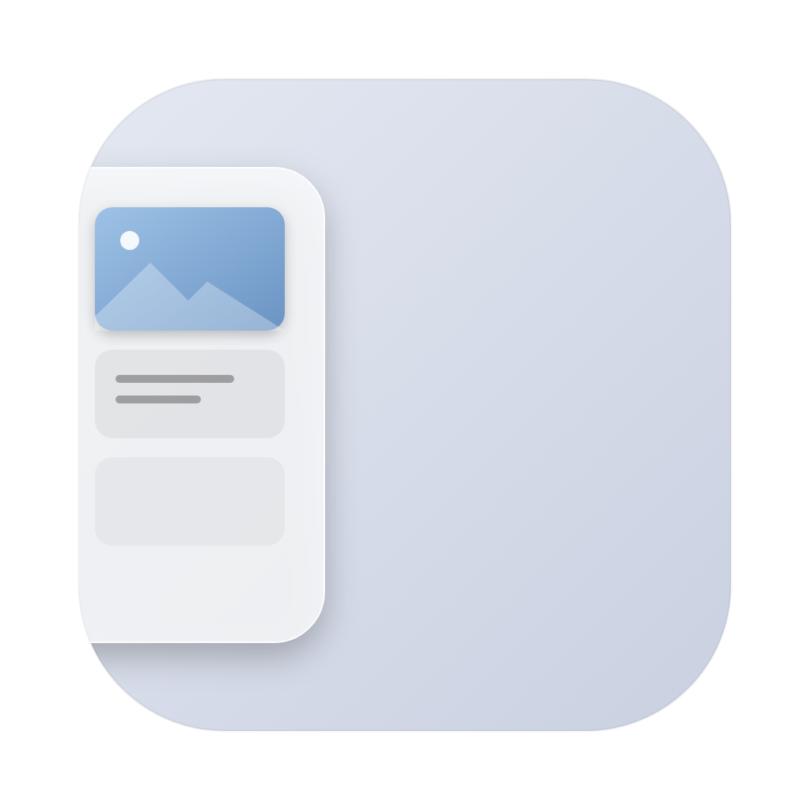

<p align="center">
  
</p>

<h1 align="center">ClipShelf</h1>

<p align="center">
  A tiny drop zone that lives on the edge of your Mac screen.<br>
  Drag things in, grab them later. Free, open source, no account.
</p>

<p align="center">
  <a href="README.md"></a>
  <a href="README.ko.md"></a>
  <a href="https://github.com/E-JIWON/clipshelf/releases/latest"></a>
  
</p>

---

You take a screenshot, and now you need it in three places. You copy a snippet, then copy something else and lose it. ClipShelf is the in‑between spot: a small glass panel tucked into the screen edge that holds whatever you throw at it until you're done.

## What it does


- **Drop anything** — screenshot thumbnails, images, text selections, files. Or click the panel and press ⌘V.
- **Drag it back out** — into Finder, Slack, Notion, Figma, anywhere. Images go as real files, text as text.
- **Peek without leaving** — click a card for Quick Look. Text cards open as an editor and save as you type.
- **Stays out of the way** — hides to a 10px tab at the edge. Hover the tab, or start dragging anything anywhere, and it slides out.
- **Lives where you put it** — drag the panel to either side of the screen and it snaps and remembers. Pin it to keep it open.
- **Nothing to configure** — no accounts, no sync, no settings window. Items are plain files in `~/Library/Caches/ClipShelf`.

## Install

**Download** (macOS 14 Sonoma or later, Apple Silicon and Intel)

1. Grab `ClipShelf.zip` from the [latest release](https://github.com/E-JIWON/clipshelf/releases/latest) and unzip it.
2. Move `ClipShelf.app` to `/Applications` and open it.
3. macOS will say the app is from an unidentified developer (it isn't notarized). Either go to **System Settings → Privacy & Security** and click **Open Anyway**, or run once:
   ```bash
   xattr -cr /Applications/ClipShelf.app
   ```
4. A tray icon appears in the menu bar. Turn on **Launch at Login** there if you want it to come back after a restart.

**Build from source**

```bash
git clone https://github.com/E-JIWON/clipshelf.git
cd clipshelf
./install.sh      # release build → ClipShelf.app → /Applications
```

Requires Xcode 15+ (or the Command Line Tools with Swift 5.9).

## How it works

| Piece | What it does |
|---|---|
| `ClipShelfApp.swift` | SwiftUI `App` entry with a `MenuBarExtra`. No Dock icon. |
| `ShelfPanel.swift` | A non‑activating `NSPanel`. Edge snapping, hide/reveal, external drag detection, Quick Look popover. |
| `Store.swift` | The data layer is a folder. One file per item; `.txt` means text. A `DispatchSource` watches it so changes from outside show up. |
| `Views/DragHandle.swift` | AppKit drag session over each card. SwiftUI's `onDrag` doesn't put `public.file-url` on the pasteboard, so other apps wouldn't accept drops. |
| `Views/` | `ShelfView`, `Card`, `TextEditView` — the SwiftUI layer. |

Two details worth knowing:

- **Reveal on drag** uses the same trick as Yoink: a global `leftMouseDragged` monitor checks whether the drag pasteboard's `changeCount` moved. If it did, someone started dragging something, and the shelf slides out to catch it.
- **Idle cost is zero.** Hide/reveal is driven by `NSTrackingArea` on the panel itself, not by polling or global mouse‑moved monitoring. When your mouse is elsewhere, the process doesn't wake up.

## Development

```bash
swift run          # run the dev build
swift test         # Store unit tests
./install.sh       # install to /Applications
kill -USR1 $(pgrep -x ClipShelf)   # dump the panel to ~/Library/Caches/ClipShelf-snapshot.png
```

## Why not just use …

- **Yoink** — great, and the inspiration. Paid, and more than I needed.
- **Universal Clipboard / Paste** — clipboard history, not a shelf. One item at a time, nothing to drag.
- **Dropover** — closer, but ClipShelf is a fixed spot on the edge rather than a window that follows your drag.

## License

MIT
